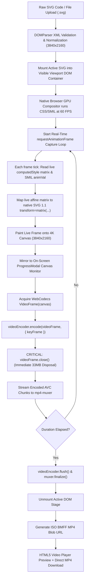

# 🎬 SVG ➔ 4K MP4 Studio

> **High-Performance Client-Side Vector Video Synthesizer**  
> Convert animated (CSS / SMIL) and static SVG code directly into pristine 4K UHD (3840×2160) 60 FPS MP4 video right in your browser with hardware-accelerated WebCodecs and zero server latency.

---

## 🌟 Key Highlights

- **True 4K UHD Export (3840 × 2160)**: Native resolution rasterization with vector fidelity (no sub-pixel blur).
- **WebCodecs + Hardware H.264 Acceleration**: Leverages GPU hardware video encoders (NVIDIA NVENC, Intel QuickSync, Apple VideoToolbox) via `mp4-muxer`. 10x-50x faster than FFmpeg.wasm with zero multi-megabyte WASM binaries to download.
- **Real-Time On-Screen DOM Canvas Stream Capture**:
  - The actual SVG is mounted directly inside an **active, visible on-screen DOM container** (`#svg-live-recording-host`) positioned within the browser viewport during recording.
  - Native CSS (`@keyframes`, CSS transforms) and SMIL animations run continuously at 60 FPS driven by the browser's hardware GPU compositor.
  - A real-time `requestAnimationFrame` loop samples each frame directly from the running DOM state.
  - Live animated affine matrices (`window.getComputedStyle(liveEl).transform` and `transformOrigin`) are sampled at each millisecond and converted into user-space SVG 1.1 `transform="matrix(a, b, c, d, e, f)"` attributes.
  - Each live frame is drawn to the 4K canvas and immediately submitted to WebCodecs as a `VideoFrame`.
  - A live on-screen canvas monitor inside the progress modal (`#live-recording-preview-canvas`) mirrors the 4K canvas buffer so you can visually watch the animation spinning in real time during encoding.
- **Rock-Solid Memory Management**: At 4K RGBA, a single uncompressed frame is **~33.17 MB**. A 5-second 60 FPS video has 300 frames (~10 GB uncompressed). This engine uses an immediate buffer disposal cycle (`VideoFrame.close()`) and reusable canvas memory to guarantee zero browser OOM crashes.
- **Modern UI / UX**: Built with React 19, TypeScript, Tailwind CSS, Lucide icons, live interactive SVG pan & zoom preview, XML validation, and customizable backgrounds (Solid, Gradients, Dark/Light transparency grids).

---

## 🚀 Quick Start

### Prerequisites
- **Node.js**: v18.0.0 or later (Node v20+ or v24+ recommended)
- **NPM** or **PNPM** or **Yarn**

### Installation

```bash
# 1. Clone or navigate to the project directory
cd svg-to-4k-mp4

# 2. Install dependencies
npm install

# 3. Start development server
npm run dev
```

Visit `http://localhost:5173` in your browser.

### Production Build

```bash
# Build optimized static bundle
npm run build

# Preview production build locally
npm run preview
```

---

## 🏗️ Architecture & Pipeline



---

## 🛠️ Feature Overview

### 1. Input Section
- **Raw SVG Editor**: Real-time syntax validation with line numbers, format XML button, copy, and clear controls.
- **File Upload**: Direct `.svg` file import with drag-and-drop support.
- **Curated 4K Presets**:
  - *Cyberpunk Neon Hexagon* (CSS keyframe rotating neon rings & pulsing laser grid)
  - *Morphing Quantum Waves* (harmonic Sine wave undulating gradients)
  - *Futuristic HUD Radar Target* (rotating radar cone with target telemetry)
  - *Solar System Planetary Orbit* (multi-speed synchronized celestial orbits)
  - *Static Vector Masterpiece* (high-density geometric crest testing instant static export)

### 2. Render & Video Configuration
- **Resolution Presets**: 4K UHD (3840×2160), 1440p QHD (2560×1440), 1080p FHD (1920×1080), and Custom with aspect ratio lock (16:9).
- **Framerate**: 60 FPS (Ultra Fluid) and 30 FPS (Standard).
- **Duration**: 1s to 60s with auto-fit detection based on detected SVG keyframe loop periods.
- **Bitrate Controls**: Pro 4K (40 Mbps), Balanced (25 Mbps), Eco (12 Mbps).
- **Background Engine**:
  - *Solid Color*: Color picker + curated swatches (Slate 950, Pure Black, Studio White, etc.).
  - *Gradient*: Linear and Radial options with angle slider and dual color inputs.
  - *Transparent*: Encodes against clean black baseline per standard MP4 AVC container specification.

### 3. Interactive Preview & Export
- **Pan & Zoom Viewport**: Drag-to-pan, zoom in/out, fit to screen, and background switchers (Video BG, Dark Grid, Light Grid).
- **Real-Time Telemetry Modal**: Progress percentage, current frame counter, encoding speed (FPS), and remaining time estimate.
- **Built-in 4K Video Player**: In-browser video scrubbing, loop playback, fullscreen, and video metadata card (file size, resolution, duration, effective bitrate).
- **One-Click Download**: Timestamped MP4 download (e.g. `svg-render-3840x2160-60fps-1727255000.mp4`).

---

## 🌐 Browser Compatibility

| Browser | WebCodecs VideoEncoder | H.264 / AVC 4K | Status |
| :--- | :---: | :---: | :---: |
| **Google Chrome** | 94+ | ✅ High Profile Level 5.1/5.2 | Fully Supported (Recommended) |
| **Microsoft Edge** | 94+ | ✅ High Profile Level 5.1/5.2 | Fully Supported |
| **Apple Safari** | 16.4+ | ✅ Hardware Acceleration | Fully Supported |
| **Mozilla Firefox** | 130+ | ✅ Supported | Fully Supported |
| **Opera / Brave** | Latest | ✅ Supported | Fully Supported |

---

## 📄 License

MIT License. Engineered for maximum vector rendering performance.
